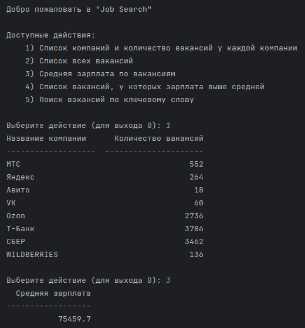
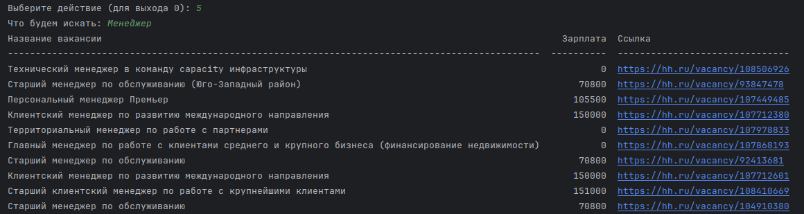
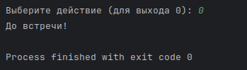

# Job Search

> [Посмотреть критерии](TASKS.md)

---

## Описание проекта:

- Получение данных о компаниях и вакансиях с сайта hh.ru

---

## Инструкция по запуска проекта

1. Создайте файла `.env` 
   - Создайте файла `.env`в корне проекта и заполните по примеру `.env.sample`.
   - `DEBUG` - указывает нужно создать таблицы, загружать данные из `API` и их запись в базу данных.
   - Убедитесь, указанная база данных у вас уже есть (создана вручную).

2. Запустите файл `app.py`

---

## Примеры

---

## Автор

[Maxim Ipatov](https://github.com/MaksimIpatov/)
